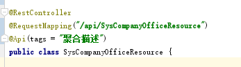
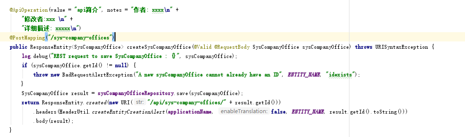
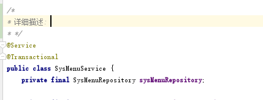
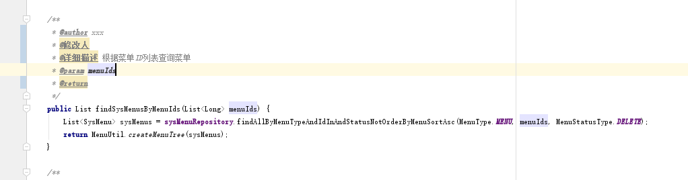

# ruoweiApp

# 工程描述

# 实践方式

# 运行方式

# 部署方式

# 待完成工作
2. 完成mapper的生成配置
3. 单元测试
5. 角色
6. 工作流引擎/日志elk/工具类完善
7. 修复bug 业务层面代码的完善
8. 工程结构的详细说明 ==> 详细的结构说明
9. 要写一个示例，如何使用咱们工程的方式  教案

代码规范要统一:
- 注释  修改的时候记得更新注释
    - api的注释 类的注释  url的规范(类和方法的)   api url的写法要符合rest风格(get查询 post添加 delete删除 put修改)
    
    
    - 方法的注释
    
    
    - 函数的内注释
    - 包的规范  每个包内都要写
    复杂逻辑需要写注释 package-info.java
    - readme相关
     - requirements
     - install
     - run
     - deploy
     - 业务逻辑 - 依赖的第三方软件设施(数据库缓存等)、依赖的第三方服务(百度云图像识别等 账号) 该工程实现的功能概述
- 狭义代码规范 - 参考阿里巴巴java代码开发规范 -- 李春浩

## 工具类
### Apache Commons Lang3 介绍

1.StringUtils常用方法

    // 判断字符序列是否包含某字符序列
    boolean contains(final CharSequence seq, final CharSequence searchSeq)
    // 判断字符序列是否包含字符序列数组中的某一个字符序列
    boolean containsAny(final CharSequence cs, final CharSequence... searchCharSequences)
    // 删除字符序列中所有空格
    String deleteWhitespace(final String str)
    // 判断字符序列是否以某字符序列结尾
    boolean endsWith(final CharSequence str, final CharSequence suffix)
    // 判断字符序列是否相同
    boolean equals(final CharSequence cs1, final CharSequence cs2)
    // 判断字符序列是否只包含unicode字母
    boolean isAlpha(final CharSequence cs)
    // 判断字符序列是否只包含unicode字母或数字
    boolean isAlphanumeric(final CharSequence cs)
    // 判断字符序列是否为空字符序列、null、或仅有空格字符
    boolean isBlank(final CharSequence cs)
    // 判断字符序列是否为空字符序列或null
    boolean isEmpty(final CharSequence cs)
    // 判断所有字符序列是否都不是空字符串、null、或全空格字符
    boolean isNoneBlank(final CharSequence... css)
    // 判断所有字符序列是否都不是空字符串或null
    boolean isNoneEmpty(final CharSequence... css)
    // 判断某字符序列是否不是空字符串、null、或全空格字符
    boolean isNotBlank(final CharSequence cs)
    // 判断某字符序列是否不是空字符串或null
    boolean isNotEmpty(final CharSequence cs)
    // 判断某字符序列是否只包含unicode数字
    boolean isNumeric(final CharSequence cs)
    // 将字符数组以指定分隔符合并为一个字符串
    String join(final char[] array, final char separator)
    // 获取字符串最左侧的N个字符
    String left(final String str, final int len)
    // 用指定字符串将某字符串从左侧填充到指定长度
    String leftPad(final String str, final int size, String padStr)
    // 将所有指定字符串替换为其他字符串
    String replace(final String text, final String searchString, final String replacement)
    // 以指定分隔符将字符串分割为字符数组
    String[] split(final String str, final String separatorChars)
    // 从指定索引处开始截取字符串
    String substring(final String str, int start)
    // 从最左侧开始截取指定最大长度的字符串
    String truncate(final String str, final int maxWidth)
    
2.ArrayUtils常用方法

    // 拷贝数组并在尾部追加新元素
    <T> T[] add(final T[] array, final T element)
    // 浅拷贝数组
    <T> T[] clone(final T[] array)
    // 判断数组是否包含某元素
    boolean contains(final Object[] array, final Object objectToFind)
    // 判断数组是否为空数组或null
    boolean isEmpty(final Object[] array)
    // 判断数组是否不为空数组且不为null
    <T> boolean isNotEmpty(final T[] array)
    // 移除数组中指定位置的元素
    <T> T[] remove(final T[] array, final int index)
    // 移除数组中第一个指定元素
    <T> T[] removeElement(final T[] array, final Object element)

3.NumberUtils常用方法

    // 将字符串转为数字
    Number createNumber(final String str)
    // 取数组中最大值
    int max(final int... array)
    // 取数组中最小值
    int min(final int... array)

### JAVA8的java.time包介绍

1.LocalDate是ISO格式（yyyy-MM-dd）的日期（不包含时间部分）

    // 创建
    LocalDate localDate = LocalDate.now()
    LocalDate.of(2015, 02, 20)
    LocalDate.parse("2015-02-20")
    // 转换为LocalDateTime
    LocalDateTime atTime(int hour, int minute, int second)
    // 日期比较
    int compareTo(ChronoLocalDate other)
    boolean isAfter(ChronoLocalDate other)
    boolean isBefore(ChronoLocalDate other)
    boolean isEqual(ChronoLocalDate other)
    // 日期间隔
    long until(Temporal endExclusive, TemporalUnit unit)
    // 获取所在月份的几号
    int getDayOfMonth()
    // 获取周几
    DayOfWeek getDayOfWeek()
    // 获取所在年份的第几天
    int getDayOfYear()
    // 获取月份
    Month getMonth()
    // 日期加减
    LocalDate plus(long amountToAdd, TemporalUnit unit)
    LocalDate minus(long amountToSubtract, TemporalUnit unit)
    // 日期解析
    LocalDate parse(CharSequence text, DateTimeFormatter formatter)
    
2.LocalTime是时间（不包含日期）

    // 创建
    LocalTime now = LocalTime.now()
    LocalTime sixThirty = LocalTime.parse("06:30")
    LocalTime sixThirty = LocalTime.of(6, 30);
    // 解析和加减
    LocalTime sevenThirty = LocalTime.parse("06:30").plus(1, ChronoUnit.HOURS);
    boolean isbefore = LocalTime.parse("06:30").isBefore(LocalTime.parse("07:30"));

3.LocalDateTime日期+时间

    // 创建
    LocalDateTime.now()
    LocalDateTime.of(2015, Month.FEBRUARY, 20, 06, 30)
    LocalDateTime.parse("2015-02-20T06:30:00")
    // 加减
    localDateTime.plusDays(1)
    localDateTime.minusHours(2)
    
4.ZonedDateTime日期+时间（包含时区）

    // 创建时区
    ZoneId zoneId = ZoneId.of("Europe/Paris")
    // 将LocalDateTime转为ZonedDateTime
    ZonedDateTime zonedDateTime = ZonedDateTime.of(localDateTime, zoneId)

5.Date和Calendar转LocalDateTime

    LocalDateTime.ofInstant(date.toInstant(), ZoneId.systemDefault())
    LocalDateTime.ofInstant(calendar.toInstant(), ZoneId.systemDefault())

## Development

To start your application in the dev profile, simply run:

    ./gradlew

For further instructions on how to develop with JHipster, have a look at [Using JHipster in development][].

## Building for production

### Packaging as jar

To build the final jar and optimize the ruoweiApp application for production, run:

    ./gradlew -Pprod clean bootJar

To ensure everything worked, run:

    java -jar build/libs/*.jar

### Packaging as war

To package your application as a war in order to deploy it to an application server, run:

    ./gradlew -Pprod -Pwar clean bootWar

## Using Docker to simplify development (optional)

A number of docker-compose configuration are available in the [src/main/docker](src/main/docker) folder to launch required third party services.

For example, to start a mysql database in a docker container, run:

    docker-compose -f src/main/docker/mysql.yml up -d

To stop it and remove the container, run:

    docker-compose -f src/main/docker/mysql.yml down

You can also fully dockerize your application and all the services that it depends on.
To achieve this, first build a docker image of your app by running:

    ./gradlew bootJar -Pprod jibDockerBuild

Then run:

    docker-compose -f src/main/docker/app.yml up -d

